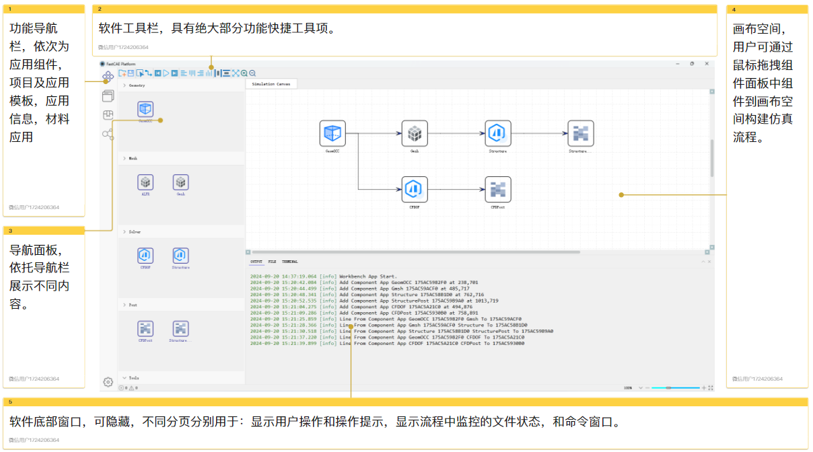
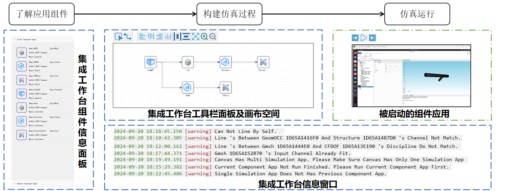
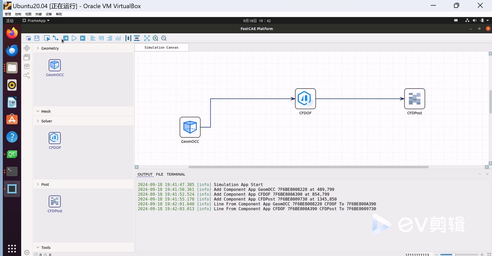
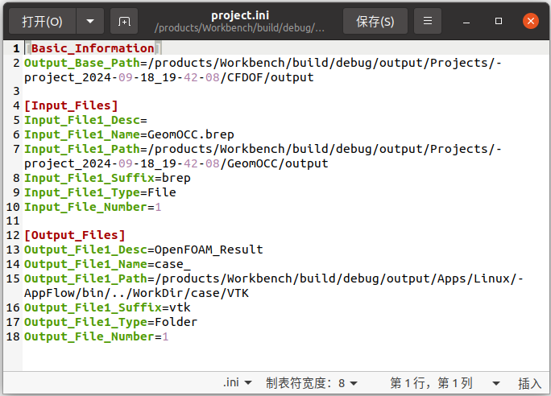
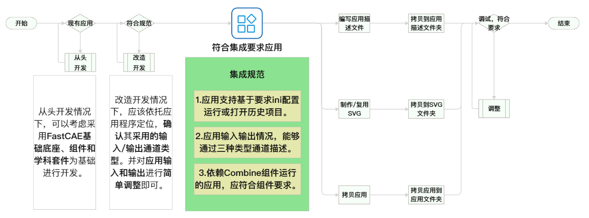
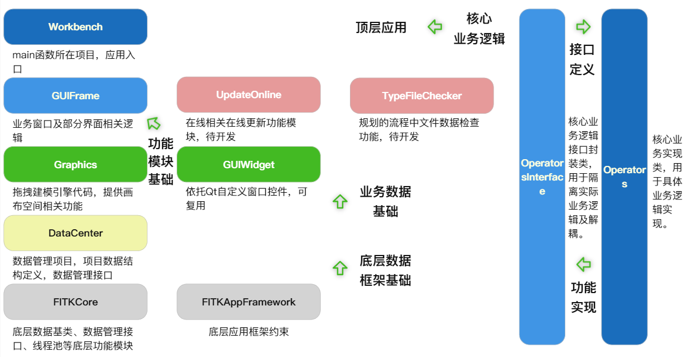
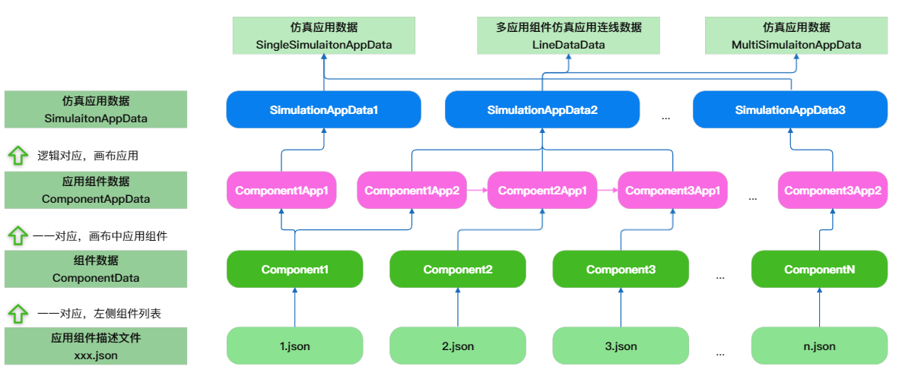

# FastCAE-Workbench 项目

FastCAE—Workbench一个集成工程仿真环境，为用户提供一体化的仿真工具，涵盖不同学科领域，有效对FastCAE生态版中不同应用软件进行整合，形成合力提供仿真服务和一体化的功能界面

---

## 软件界面介绍

软件界面风格采用仿真领域的界面布局方式，减少用户的使用难度。界面部分功能详情见标注部分。



 ## 功能特性

- **拖曳建模引擎:**
集成工作台拖拽建模是构建仿真的基础，在拖拽建模前要对组件应用的信息有了解，知道组件应用学科类型和通道类型。依照仿真业务，拖拽左侧面板中应用组件到画布空间，在连线模式下，构建仿真流程。


	
案例视频：
[](./Doc/案例.mp4)


- **应用软件封装集成**
  - 待封装应用软件要满足： 要将应用软件封装到集成工作台中，应用需支持命令行参数方式启动运行，启动运行后能够读取控制台提供的输入并基于应用定位进行功能展示或信息输出。控制台运行形式为：App.exe -FITKWB project.ini。
  
  - 应用运行project.ini： 
  
    - Output_Base_Path，工作台推荐结果文件输出路径；
  
    - Input_File_Number，输入文件数量；
  
    - Input_FileX_Type，类型可以为文件File，文件夹Folder；
  
    - Input_FileX_Desc，文件描述信息，具有同类型且需要区分时的区分字段。
    
    - 
  - 打开项目open_project.ini：
    - Input_File_Number,值为1;
    - Input_File1_Name = PROJECT 
    
  - 封装流程：
  
    


------

## 项目结构

#### 目录结构
```
output
├── AppComponents
│   ├── Linux
│   └── Windows
├── Apps
│   ├── Linux
│   └── Windows
├── AppTemplate
└── bin
```

- 相关介绍

  AppComponents : 应用组件描述文件夹，内部有所有组件的描述文件集。集成工作台依托该信息加载应用组件。

  Apps: 应用程序所在文件夹，内有所有组件可执行环境，且要求组件可不依赖外部环境运行。

  AppTemplate: 应用模板文件夹，用户自定义应用模板将保存在该文件夹下。

  Bin: 集成工作台程序主文件夹，内含集成工作台可执行程序和所有依赖项。

#### 代码结构
Workbench代码结构如下图所示，目前整个解决方案由11个项目构成，项目功能职责清晰，注释规范，支持具有开发能力用户基于代码进行Workbench使用



#### 数据结构

基于Workbench整体功能定位和依托拖拽建模引擎构建仿真应用的功能定位，整体数据结构设计如下




## 详细资料与文档

项目相关的详细使用说明、开发文档及相关资料请访问我们的资料库：

FastCAE 详细资料库：https://gitcode.com/FastcaeCode/FastCAEDocs.git

您可以克隆该仓库获取最新的文档内容，帮助您快速上手和深入了解 FastCAE。

## 快速开始

具体编译说明请查看 /Doc/编译说明文档.pdf

## 开源信息

FastCAE 遵循开源协议，相关的开源组件及其许可证信息详见项目根目录下的 `License.txt` 文件，请务必阅读了解相关内容。

## 联系方式

为了更好地沟通和交流，FastCAE 提供以下几种官方交流群方式：

- **微信群**  
  微信群有有效期限制，需先添加客服微信，由客服拉您进群。  
  请添加客服微信：备注“FastCAE交流群”，客服会邀请您加入微信群。
   

- **QQ群**  
  QQ 群常驻，扫码即可加入。 

    